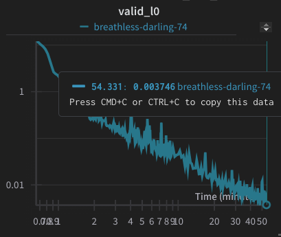

# Minimal Example 
Try on <a href="https://colab.research.google.com/drive/1RzRK2lD1VTgD9GMow4LKtrkRg6_kshWK?usp=sharing">Google Colab</a>. It trains a Transformer using quantum chemistry as a "backprop-able loss function" (specifically, <a href="https://www.nobelprize.org/uploads/2018/06/kohn-lecture.pdf">density functional theory</a>). This allows us to generate data on the fly. In this example, we use different <a href="https://www.google.com/url?sa=i&url=https%3A%2F%2Fonlinelibrary.wiley.com%2Fdoi%2Ffull%2F10.1002%2Fjcc.25589&psig=AOvVaw0ykdEHXIJkMyXfBnwFvldp&ust=1708019327173000&source=images&cd=vfe&opi=89978449&ved=0CBMQjRxqFwoTCKDy8_uxq4QDFQAAAAAdAAAAABAE">alanine dipeptides</a> with angles randomly from [0,45]. 

```
python train.py -backend gpu -level 0 -basis sto3g -mol_repeats 12 -nn -small -lr 5e-6 -min_lr 1e-6 -warmup_iters 100 -workers 7 -alanine -eri_threshold 1e-7 -nn_f32 -eri_f32 -xc_f32 -foriloop -lr_decay 10000 -rotate_deg 45 -bs 4 -wandb -checkpoint 1000
```

The plot below show error |DFT-Transformer| on a validation angle during training. It reached ~4meV in 1h on my laptop (RTX 3070 with 20tflops32 and 0.3tflops64). Chemical accuracy is 42meV. 



# Goal: Scale to 10B QPT on Proteins
todo
- implement integral pre-screening `libcint/` (currently uses naive N^4/8 strategy; should reduce to at least O(N^3)) 
- batch similar protein-ligand interactions by moving ligand (currently batches dipeptide by rotating one angle)
- use PBE instead of B3LYP (<a href="https://citeseerx.ist.psu.edu/document?repid=rep1&type=pdf&doi=dd944567fd5930aa7f35d80bcebfbbf7f847a289">prior work</a> claim it converges faster for proteins) 
- pre-train HF/sto3g/f32, finetune DFT PBE/def2-svp/f64
- scale to 1000 hardware accelerators 

# Why should engineers care about proteins?
Proteins are nano robots. Example: the protein "ATP synathase" is an <a href="https://bionumbers.hms.harvard.edu/bionumber.aspx?s=n&v=8&id=111322#:~:text=%22%5BResearchers%5D%20favorite%20biological%20molecule,life%20%5Bprimary%20sources%5D.%22">10x10x20nm "motor"</a> rotating <a href='https://www.neuro.duke.edu/files/sites/yasuda/pub/0302207335.pdf'>100 times/s</a>. Proteins have nice engineering properties: 
1. Proteins source code are RNA strings {0,20}^l. We know the source-code of <a href='https://www.uniprot.org/uniprotkb/statistics'>250M</a> nano robots (e.g. source code of <a href='https://berthub.eu/articles/posts/reverse-engineering-source-code-of-the-biontech-pfizer-vaccine/'>mRNA vaccine</a>). 
2. Proteins are cheap to produce, we inherited a <a href="https://en.wikipedia.org/wiki/Ribosome">30x30x30nm protein factory</a> from evolution (ribosome). 

Current state: We can predict the static structure of our nano robots with <a href="https://alphafold.ebi.ac.uk/entry/A0A671WMU1">AlphaFold</a>. This is huge. If we didn't know that ATP synthase is an engine, AlphaFold could predict its structure from its source code. We could probably guess from the structure that it's an engine. 
But we want to design new nano robots. If we want to design a new nano robot engine, we need to understands its dynamical behaviour. I conjecture the following is sufficient: pre-train a 10B Transformer on 10B quantum protein examples, fine-tune it on the <a href='https://www.rcsb.org/stats/growth/growth-released-structures'>200k</a> experimentally scanned proteins. 


# License 
Code is a PySCF-IPU fork. PySCF-IPU is Apache 2.0 like PySCF, with two exceptions: xcauto and libcint. Plan for future version to use jax-xc instead of xcauto. 
